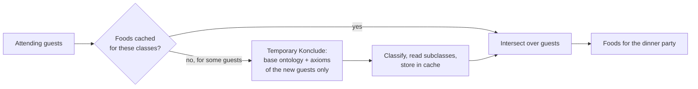

# Diet Ingredient Calculator

A small desktop application that answers two questions on a food ontology, using an OWL reasoner:

1. **Custom diet** – *Which foods are allowed for a diet I define by selecting base ingredients?*
2. **Dinner party** – *Which foods can all my guests eat, given each guest's permitted, favorite and forbidden foods?*

It is written in Java (Swing + [FlatLaf](https://www.formdev.com/flatlaf/)), reads the ontology with the
[OWL API](https://github.com/owlcs/owlapi) and delegates all reasoning to [Konclude](https://github.com/konclude/Konclude)
via OWLlink. The application starts and stops Konclude for you.

---

## Contents

- [How it works](#how-it-works)
  - [The ontology](#the-ontology)
  - [Custom diet](#custom-diet)
  - [Dinner party](#dinner-party)
  - [Caching and persistence](#caching-and-persistence)
- [Requirements](#requirements)
- [Build and run](#build-and-run)
- [Configuration](#configuration)
- [Using the application](#using-the-application)
- [Files the application writes](#files-the-application-writes)
- [Project layout](#project-layout)
- [Limitations and notes](#limitations-and-notes)

---

## How it works

### The ontology

The tool expects a food ontology in the style of the BAALL `FOOD` ontology (namespace
`http://ontologies.baall.de/FOOD#`), which provides

| Element                                         | Used for                                                    |
| ----------------------------------------------- | ----------------------------------------------------------- |
| `Food`                                          | root of the class tree; all foods are its subclasses        |
| `processed_from`                                | relates a food to the foods it is made from                 |
| `Diet`, `permits`, `permittedBy`, `forbiddenBy` | modelling of diets, e.g. `Vegan_Diet ⊑ ∃permits.Vegan_Food` |

The ontology is classified once at startup (Konclude, about 30 s for the ~5 MB reference ontology), and the class
hierarchy is shown as a searchable tree.

### Custom diet

You select base food classes (e.g. `StrictVeganIngredient`, `DairyIngredient`, `FishIngredient`) and name a new dietary
concept `D`. The tool adds

```
D ≡ ∃processed_from.D  ⊓  ∀processed_from.D        (closure axiom)
C ⊑ D                                               (for every selected class C)
D_Diet ⊑ Diet,  D_Diet ⊑ ∃permits.D                 (registers D as a diet, like the existing ones)
```

and asks the reasoner for the subclasses of `D`: exactly the foods that are processed **only** from the selected
classes. The result is shown in a list that can be searched and copied.

The new concept is also inserted into the class tree. **Save ontology** overwrites the ontology file (after a
confirmation, via a temporary file so a failure never leaves a half-written ontology) so the diet becomes part of it.

### Dinner party

Each guest has three categories of food classes:

| List          | Meaning                                                                                   |
| ------------- | ----------------------------------------------------------------------------------------- |
| **Permitted** | foods the guest may eat (foods processed only from these are permitted, too)              |
| **Favorite**  | foods the guest likes (foods processed only from these are favorite, too)                 |
| **Forbidden** | foods the guest must not eat (anything processed from a forbidden food is forbidden, too) |

A guest's foods are

> (permitted **∩** favorite) **∖** forbidden

where an empty permitted or favorite list does not restrict anything. The dinner party's foods are the intersection over
all attending guests.

For each guest the tool generates axioms in the same style as above (`User_<name>_Permitted_Food`,
`User_<name>_Favorite_Food`, `User_<name>_Forbidden_Food`, plus a `User_<name>_Diet`), classifies the ontology with them
and reads the subclasses. There is deliberately no axiom of the form `Food ≡ Permitted ⊓ ¬Forbidden`: ontologies rarely
state disjointness, so the reasoner could almost never prove that a food is *not* forbidden. Instead, a food is removed
only when it is *provably* forbidden.



Click **Add example guests** to try it: a vegan guest with a nut allergy, a halal guest, a kosher guest and a vegetarian
guest with favorite foods but no onions. With the reference ontology they can share six foods: apple, basmati rice,
cherry tomato, olive oil, potato and tomato.

### Caching and persistence

Classifying the ontology dominates the run time (25–45 s), so results are cached:

- The foods for a set of classes are cached by a **SHA-256 hash of the ontology's axioms** plus the classes. A cached
  result is only used for exactly the same axioms; changing the ontology (for example by creating a diet) drops it.
- The cache is written to disk, so it survives restarts as long as the ontology is unchanged.
- Users and attendance of the dinner party are persisted after every change, so a dinner party can be continued later.

Repeating a computation, or changing which known guests attend, needs no reasoner at all. Only guests with class sets
not seen before are classified.

---

## Requirements

| Tool            | Version | Notes                                                                                     |
| --------------- | ------- | ----------------------------------------------------------------------------------------- |
| **JDK**         | 27      | `maven.compiler.release` is 27                                                            |
| **Maven**       | 3.8+    | or use the Maven bundled with your IDE                                                    |
| **Konclude**    | 0.7.0   | [releases](https://github.com/konclude/Konclude/releases); tested with `v0.7.0-1135` only |
| **An ontology** | –       | a `FOOD`-style OWL file as described [above](#the-ontology)                               |

Windows, macOS and Linux are supported (on macOS/Linux the Konclude binary must be executable; the application sets the
flag if needed).

> The ontology `src/main/resources/ontology.owl` is only a tiny placeholder and does not contain the food classes; point
> `ontology.file` to a real food ontology.

---

## Build and run

1. **Get Konclude** and unpack it anywhere below the folder configured in `reasoner.konclude.folder` (by default your
   `Downloads` folder; folders named `Konclude*` up to three levels deep are searched).

2. **Set the ontology** – edit `ontology.file` in [`application.yaml`](application.yaml), or later in the settings
   dialog (gear icon).

3. **Build and start:**
   
   ```bash
   mvn spring-boot:run
   ```
   
   Only compiling:
   
   ```bash
   mvn compile
   ```

The application must be started from the project directory, since `application.yaml` is read from the working
directory. On start, Konclude is launched, the ontology is loaded and classified (a loading screen shows the progress),
and the main window opens.

---

## Configuration

All settings live in [`application.yaml`](application.yaml) and can also be edited in the application (gear icon;
comments in the file are preserved). Changes take effect after a restart, except the theme.

| Key                               | Default                  | Meaning                                                                         |
| --------------------------------- | ------------------------ | ------------------------------------------------------------------------------- |
| `ontology.file`                   | –                        | path of the ontology to load; **Save ontology** writes back to this file        |
| `reasoner.konclude.owllinkserver` | `http://localhost:8080`  | host and port of the OWLlink server Konclude is started on                      |
| `reasoner.konclude.folder`        | `${user.home}/Downloads` | where to look for the Konclude distribution                                     |
| `reasoner.konclude.workers`       | `AUTO`                   | Konclude threads; `AUTO` uses all cores                                         |
| `reasoner.konclude.keep-running`  | `false`                  | leave Konclude running on exit so the next start reuses its classified ontology |
| `ui.theme`                        | `light`                  | `light` or `dark`                                                               |
| `logging.file.path`               | `log`                    | folder of the application and Konclude logs                                     |

With `keep-running: true`, Konclude keeps the classified base ontology (identified by a hash of its axioms) in memory, and
the next start skips the initial classification. Note that Konclude then holds several GB of memory until you stop it.

---

## Using the application

The two views are the **tabs in the window's title bar**; the gear on the right opens the settings.

### Custom Diet

1. Search the class tree, select a class and add it (`+`, or double-click) to the list on the right.
2. **Compute permitted ingredients**, enter a name for the new diet, and wait for the result list.
3. **Save ontology** to write the new diet into the ontology file (enabled when there is something to save).

### Dinner party

1. **Add user** (`+`) opens an editor. On the left is the class tree, on the right the guest's foods as a **forest with
   three roots**: *Permitted*, *Favorite* and *Forbidden* foods (an empty *Permitted* or *Favorite* root means "any
   food").
2. Put foods into a root by
   - **dragging** a class from the tree onto a root, or
   - selecting it and clicking ✓ (permit), ★ (favorite) or ⊘ (forbid), or double-clicking to permit it.
3. **Move foods between the roots** by dragging them onto another root, or select them and use the ✓ ★ ⊘ buttons of the
   forest. Hold **Ctrl** while dragging to copy instead of move; `−` or the `Delete` key removes the selection. A
   forbidden food is neither permitted nor favorite, so moving it there removes it from the others.
4. Below each root, foods keep the **structure of the taxonomy**: a food is shown below its nearest ancestor that is in
   the same root (e.g. forbidding *AlcoholFood* and *Spirit* shows *Spirit* below *AlcoholFood*). Moving or removing a
   food includes the foods below it.
5. Tick the users that attend (checkbox or space bar) and press **Compute dinner party foods**.

The same forest is shown for the selected user in the dinner party tab, where dragging, the buttons and the search field
work as well; `+` there opens the editor. Double-click a user to edit them.

---

## Files the application writes

| File                                   | Purpose                                                             |
| -------------------------------------- | ------------------------------------------------------------------- |
| `<tmp>/bkb-script-3/dinner-party.json` | users and attendance of the dinner party                            |
| `<tmp>/bkb-script-3/food-cache.json`   | cached foods, keyed by the ontology's axiom hash                    |
| `<tmp>/bkb-script-konclude-<port>.pid` | PID of the Konclude started by the application (for `keep-running`) |
| `log/`                                 | application log, `konclude.log`, `konclude-temporary.log`           |
| the ontology file                      | only when you press **Save ontology**                               |

`<tmp>` is the operating system's temporary folder (`java.io.tmpdir`), e.g. `%TEMP%` on Windows and `/var/folders/…` on
macOS. Delete the JSON files to reset the application state.

---

## Project layout

```
src/main/java/org/example/
├── App.java                     entry point, look and feel, Spring context
├── MainFrame.java               main window, custom diet, class tree, title-bar tabs
├── DinnerPartyPanel.java        guests, attendance, compute button
├── UserEditorDialog.java        edit the foods of a guest: class tree + forest
├── FoodCategories.java          permitted / favorite / forbidden categories of the forest
├── DietUser.java                a guest (record)
├── DinnerPartyAxioms.java       axioms that define a guest's foods
├── DinnerPartyPlanner.java      cache lookup, reasoning for new guests, intersection
├── FoodResultCache.java         results by ontology axiom hash, persisted
├── DinnerPartyStore.java        persists guests; example guests
├── OntologyManager.java         loads and saves the ontology (OWL API)
├── KoncludeServer.java          starts / stops Konclude and temporary instances
├── KoncludeManager.java         creates reasoners for the ontology plus extra axioms
├── ReusableKBReasoner.java      OWLlink reasoner with hash-identified knowledge bases
├── SettingsDialog.java          settings dialog, application.yaml editing
└── gui/components/              search trees and lists, category forest (drag and drop), icons, loading panels
```
